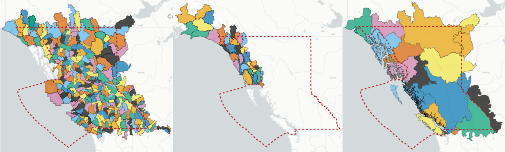

Automated Basin Delineation and Attribute Extraction
====================================================

This repository provides an example of how an automated pipeline for
generating large samples of basins from DEM may be carried out. First,
DEM files are collected from an open-source repository, then assembled
into a raster tile mosaic. The study region (British Columbia) is broken
into “complete” basin sub-regions, defined by boundaries crossed only by
outflowing streams. The polygons describing these sub-regions are used
to create clipped rasters, which are then hydraulically conditioned
(fill depressions and resolve flats) to create flow direction, flow
accumulation, and stream network rasters. The stream network raster is
used as a binary mask to identify river confluences to use for the final
step, basin delineation.

The resulting collection of basins is an approximated decision space for
the network optimization problem. The basin delineation process raises
interesting questions about digital representation of stream networks
and basin attributes. In the DEM preprocessing steps, we use topography
to identify stream networks. Stream networks are represented by cells
that meet a minimum flow accumulation threshold. There is no single
number to represent this minimum threshold, but here we assume a
constant value and the user should interpret these smallest headwater
basins with caution.

> **Note**  This repository is not production software, the code is
> provided as-is as an example of how a large sample of basins can be
> delineated while capturing a variety of well known attributes. The
> user is responsible for ensuring the code is suitable for their
> purposes.

Set up Computing Environment
----------------------------

**Note, this code was tested on Ubuntu Linux with Python 3.10.**  
Update packages:  
&gt;`$ sudo apt update`

Install dependencies:  
&gt;`$ sudo apt-get install gdal-bin`

Clone the repository (from the root directory):  
&gt;`$ git clone https://github.com/dankovacek/bcub`

Change directories to the `bcub` folder:  
&gt;`$ cd basin_generator`

### Create virtual environment and activate to install libraries

Install pip:  
&gt;`$ sudo apt install python3-pip`

Create virtual environment at the project root level directory:  
&gt;`$ python3 -m venv env/`

Activate the virual environment:  
&gt;`$ source env/bin/activate`

Install Python packages:  
&gt;`$ pip install -r requirements.txt`

<!-- 
### High Performance Array Computing

The basin delineation and attribute extraction steps take a lot of time. To speed up the process, namely for array computations on large basins, the Jax library is used to enable GPU computation. See [installation details](https://github.com/google/jax#pip-installation-gpu-cuda-installed-via-pip-easier) for more information. Alternatively, you can use the equivalent numpy functions where the Jax library is used.

To get your system’s version of CUDA (on Linux): &gt;`$ nvidia-smi`

 -->

Data Acquisition and Processing
-------------------------------

### USGS 3DEP DEM (U.S. Geological Survey 2020)

Basin polygons and terrain attributes are derived from the [USGS 3D
Elevation Program](https://www.usgs.gov/3d-elevation-program). The
product used for this dataset is the 1 arcsecond (small gaps along the
Alaska-Yukon border are infilled with 2 arcsecond data). The tiles can
be downloaded from the [USGS map
downloader](https://apps.nationalmap.gov/downloader/). A text file
pre-populated with the links to covering tiles is provided in this repo.
The tiles can be downloaded and merged into a virtual raster with gdal
by running the `get_3DEP_DEM.py` script saved under `setup_scripts`:  
&gt;`$ python get_3DEP_DEM.py`

> **Warning**  **The tile list urls will at some point change**:
> After downloading, compare the study region polygon with the tile set
> (vrt) to ensure al covering tiles are downloaded. Links to invidivual
> DEM tiles look like the following:  
> `https://prd-tnm.s3.amazonaws.com/StagedProducts/Elevation/1/TIFF/historical/n62w130/USGS_1_n62w130_20130911.tif`

The .vrt mosaic created by the script will look similar to the image at
left when viewed in QGIS or similar software. After clipping rasters and
reassembling the resulting files to another `.vrt`, it should look like
the image at right:

Sub-region Polygons
-------------------

The study region is split into sub-regions that describe “complete
basins”, in other words the region bounds have no inflows, only
outflows. This is an important property when delineating basins at
arbitrary points in space. The sub-regions are derived from Water Survey
of Canada sub-sub-catchment (SSC) polygons from the National
Hydrographic Network (NHN) and from the USGS for southeast Alaska.

A zipped archive file of region polygons is provided in
`input_data/region_polygons.zip`. Unzip the folder in its existing
location.

> `$ unzip input_data/region_polygons.zip -d input_data/region_polygons/`

> :warning: **Sub-region naming does not perfectly follow the NHN WUL
> naming convention.**

DEM Processing
--------------

Here we clip DEM files using the sub-region polygons because the study
region is too large to process as a whole.
[Whiteboxtools](https://www.whiteboxgeo.com/manual/wbt_book/intro.html)
is used here for the DEM processing steps of hydraulic conditioning,
flow direction, accumulation, and stream network generation.

### Clip DEM by sub-region and process stream networks

Create the individual region DEM files using the provided region
polygons and the DEM tile mosaic created in the previous step:  
&gt;`$ cd setup_scripts/`  
&gt;`$ python clip_region_DEM.py`

> **Note**  **Check the list of region polygons to process**: The dem
> processing scripts are initialized to test just the smallest region
> (08P - Skagit basin in Washington / BC). To process all regions,
> comment out the line `region_codes = ['08P']`

Process the region DEMs to create rasters representing flow direction,
flow accumulation, and stream network:  
&gt;`$ python derive_flow_accumulation.py`

Generate pour points
--------------------

Using the stream raster, generate pour points at river confluences.
Confluences are defined as stream cells with more than one inflow. An
inflow is an adjacent stream cell whose flow direction points to the
focal cell. &gt;`$ python find_pour_points.py`

### Hydrographic features dataset

The last step before basin delineation is to filter spurious pour
points.

> **Note**  The hydrographic features file is large (14 GB, 29 GB
> uncompressed) and may take a while to download. The file is not
> included in this repository.

First, download the hydrographic features dataset
(\`rhn\_nhn\_hhyd.gpkg.zip\`\`) from the [National Hydrographic
Network](https://open.canada.ca/data/en/dataset/a4b190fe-e090-4e6d-881e-b87956c07977).

Create a folder for the NHN data (*from the root directory*):
&gt;`$ mkdir input_data/NHN_data` Specify the new directory as the
destination for the download using wget (alternatively just visit the
link and download the file manually):
&gt;`$ wget https://ftp.maps.canada.ca/pub/nrcan_rncan/vector/geobase_nhn_rhn/gpkg_en/CA/rhn_nhn_hhyd.gpkg.zip -P input_data/NHN_data`
Unzip the file:
&gt;`$ unzip -j -d input_data/NHN_data input_data/NHN_data/rhn_nhn_hhyd.gpkg.zip`
Remove the zip file:
&gt;`$ rm input_data/NHN_data/rhn_nhn_hhyd.gpkg.zip`

> **Warning**  **There is currently a bug preventing geopandas/fiona
> from opening this file**: The bug seems to be related to this
> [issue](https://github.com/Toblerity/Fiona/issues/1270). A PR appears
> to have been submitted to resolve the issue, so check for updates. As
> a workaround, the `pyogrio` engine is specified and a bounding box is
> provided at import. see the `lakes_filter.py`.

### Filter spurious pour points

Once the file is downloaded, the `lakes_filter` script will clip the NHN
water bodies features to each sub-region polygon to reduce RAM usage.
The water body polygons are then used to filter out (spurious)
confluences in lakes. &gt;`$ python lakes_filter.py`

Land cover and soil data layers
-------------------------------

Reprojecting and clipping of land cover and soil geospatial layers is
done in `clip_and_reproject_spatial_layers.py`. You must first download
both files as they are not included in this repositpry. Land cover
rasters can be downloaded from the [North American Land Change
Monitoring System
(NALCMS)](http://www.cec.org/north-american-land-change-monitoring-system/).
The soil permeability and porosity information is contained in the
[GLobal HYdrogeology MaPS
(GLHYMPS)](https://borealisdata.ca/dataset.xhtml?persistentId=doi:10.5683/SP2/TTJNIU)
dataset.

2010, 2015, and 2020 land cover rasters are available and all three are
used in the BCUB dataset. Download the NALCMS files you want to work
with from the link above, and keep note of the file path where the files
are saved or save them to a new folder at `input_data/NALCMS/`. The
files are large and may take a while to download.

The [GLHYMPS 2.0
dataset](https://borealisdata.ca/dataset.xhtml?persistentId=doi:10.5683/SP2/TTJNIU)
is about 2.6 GB compressed, or 30GB uncompressed, so be sure you have
enough disk space. The GLHYMPS dataset is clipped and reprojected at the
beginning of the `clip_and_reproject_spatial_layers.py` script. The
download file is a zip archive `GLHYMPS.zip`. Unzip the nested archive
files and uncompress the files the `GLHYMPS.gdb` file to the
`input_data/GLHYMPS/` folder.

The GLHYMPS dataset contains global coverage and it is over 30GB
uncompressed, so you want to first clip it to the bounding box of the
study region and then reproject to EPSG 3005. The reprojection step is
important to do once at the outset instead of reprojecting at each basin
intersection operation. The clipped and reprojected GLHYMPS file should
be saved to the `input_data/GLHYMPS/` folder.

### Basin delineation

The data preparation work is nearly complete, now we generate a large
sample of basins to characterize the decision space (of candidate
monitoring locations).

Generate a basin for each of the pour points:  
&gt;`$ setup_scripts/python derive_basins.py`

This script will output a file in parquet format which is a compressed,
columnar data format. To save in geojson format to read in QGIS, comment
out the `to_parquet()` line and uncomment the next line
`merged_basins.to_file(output_fpath.replace('.parquet', '.geojson'), driver='GeoJSON')`.
Note that the file will be very large because of the polygon geometry.
The parquet format is more efficient for reading and writing, but
geojson can be viewed in QGIS.

Since the basin delineation process involves clipping rasters to each
derived basin, the terrain attributes are calculated at the same time to
avoid duplicate processing.

Basin Attribute Extraction
==========================

Two methods are provided to extract attributes from the basins. The
first extracts attributes from the basin polygons as they are saved in
the parquet file by individually clipping/intersecting the polygons with
the geospatial layers containing soil and land cover information. The
second builds a Postgres + PostGIS database to take advantage of
processing performance both in basin attribute extraction and later for
large sample spatial computations.

### Direct Attribute Processing/Extraction

The `extract_attributes_direct.py` script will extract attributes from
the basin polygon sets and save them to a `geojson` file. The attributes
are extracted from the DEM, land cover, and soil data layers. Since the
pour points are unique, the pour point geometry column is used to index
rows between the basin geometry (polygon) files and the attribute files.
This makes interacting with the data more performant since we drop the
polygon geometry column that’s responsible for most of the disk space
requirement.

Postgres & PostGIS Database
---------------------------

The basic steps to build a large sample ungauged basin database are as
follows:

1.  Create database,
2.  Format geospatial layers for loading into database,
3.  Load geospatial layers and create spatial indices,
4.  Extract attributes from basin polygons and update database.

The `create_database.py` script assumes Postgres is installed, and a
user (with password) and a database have been created. See additional
notes below for a few useful commands.

For a details on setting up Postgres and PostGIS, see [this
tutorial](https://www.digitalocean.com/community/tutorials/how-to-install-and-use-postgresql-on-ubuntu-22-04).

Towards the bottom of `create_database.py`, there are four variables
that are required to establish a database connection. `db_host`,
`db_name`, `db_user`, and `db_password`. Update these variables to match
your database configuration.

> **Note**  `db_host` is typically localhost, but if you are
> connecting to a remote database, you will need to update this
> variable.

### Create a Database

Create a database, here we call it `basins`:
&gt;`$ sudo -u postgres createdb basins`

#### Enable PostGIS

Log into the database as the superuser (postgres) and enable the PostGIS
extension: &gt;`$ sudo -u postgres psql`

Switch to the ‘basins’ database &gt;`postgres=# \c basins`

Enable the PostGIS extension: &gt;`postgres=# CREATE EXTENSION postgis;`

Allow password authentication for the postgres user. This is required
for the `create_database.py` script to connect to the database. Edit the
`pg_hba.conf` file (/etc/postgresql/15/main/pg\_hba.conf) and change the
line (near the bottom of the file, note you may have version 14 instead
of 15): """ \# Database administrative login by Unix domain socket local
all postgres peer """ to

""" \# Database administrative login by Unix domain socket local all
postgres md5 """

Restart the database service after any configuration change:
&gt;`$ sudo systemctl restart postgresql`

### Create database tables for basin geometry

Run the `create_database.py` script to create the tables and populate
the database. The schema should be automatically created from the
parquet file created from executing the `derive_basins.py` script. The
`create_database` script will create the attributes table in the
`basins` database you created and populate it with geometry and basic
metadata.

### Extend the Database

The `extend_postgis_database.py` script will add the remaining
attributes. The `extend_postgis_database.py` script will take a while to
run, so it is recommended to run it in a `tmux` or `screen` session.
With PostGIS we can create raster tables which can be then used in
conjunction with the polygons to derive the same set of attributes as
generated in using the direct attribute extraction method.

Additional Notes
----------------

### List columns in a database table

Once the `create_database` script has been executed successfully:
&gt;`\d basins_schema.basin_attributes`

Create raster table
-------------------

In the example below, update the path to reflect the full filepath where
the reprojected and clipped NALCMS raster is saved. The `-s` flag
specifies the SRID, `-f` specifies the name of the raster column, `-I`
creates a spatial index, `-C` adds a constraint to the raster column,
and `-M` adds a metadata table. The `-t` flag specifies the tile size,
see the [following
stackexchange](https://gis.stackexchange.com/questions/300887/optimum-raster-tile-size)
post about optimal tile settings. The last argument is the schema and
table name. The raster table will be created in the `basins` database.

Switch users and connect to the database: &gt;`# sudo -i -u postgres`
&gt;`# psql -d basins`

Enable the postgis extension: &gt;`CREATE EXTENSION postgis;`

Enable the raster extension: &gt;`CREATE EXTENSION postgis_raster;`

Run the raster2psql function to create a raster table (this is done in
`extend_postgis_dataset.py`).
&gt;`raster2pgsql -s 3005 -e -I -C -Y 1000 -M -f nalcms_2010 -t auto /home/danbot/Documents/code/23/bcub/input_data/NALCMS/NA_NALCMS_landcover_2010_3005_clipped.tif basins_schema.nalcms_2010 | PGPASSWORD=<your-password> psql -h localhost -p 5432 -U postgres -d basins`

### PostgreSQL basics

[Instructions from
DigitalOcean](https://www.digitalocean.com/community/tutorials/how-to-install-postgresql-on-ubuntu-22-04-quickstart).

Switch to postgres role: `sudo -i -u postgres`

Access postgres prompt: `psql`

Change databases: `\c <db_name>`

Quit postgres prompt: `\q`

Return to regular system: `exit`

Change user: `sudo -i -u postgres`

basins database info:

`user: postgres` `pass: <your_password>`

Create a new database

`postgres@server:~$ createdb basins`

Create the postgis extension (done from the psql terminal after
connecting to “basins” db): &gt;`CREATE EXTENSION postgis;`

Create a postgres user with your default user name:
&gt;`sudo -u postgres createuser <username>`

### Kill a long running query:

First, find the PID of the active process:
&gt;`SELECT * FROM pg_stat_activity WHERE state = 'active';`

Kill the query: &gt;`SELECT pg_cancel_backend(<pid>);`

<!-- Automate citation formatting for the README document.

>`pandoc -t markdown_strict -citeproc README-draft.md -o README.md --bibliography bib/bibliography.bib` -->

Via the RichDEM documentation, the aspect of a basin is the direction of
the maximum slope of the focal cell (in degrees), from Hill (1981).

Next Steps
----------

U.S. Geological Survey. 2020. “USGS 3D Elevation Program Digital
Elevation Model.”
<https://data.usgs.gov/datacatalog/data/USGS:35f9c4d4-b113-4c8d-8691-47c428c29a5b>.
