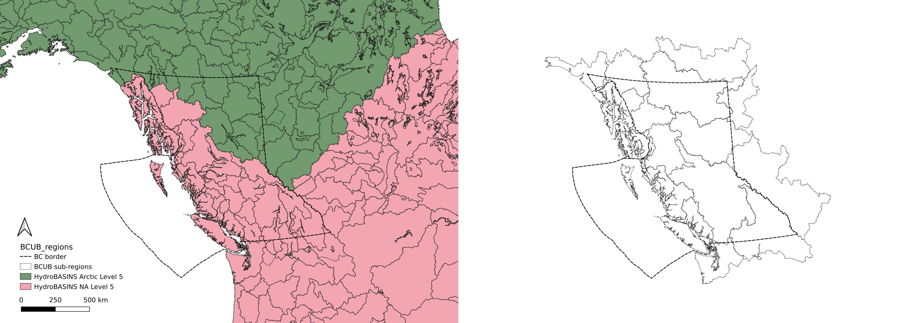

# Automated Basin Delineation and Attribute Extraction

This repository provides an example of how an automated pipeline for generating large samples of basins from DEM may be carried out. First, DEM files are collected from an open-source repository, then assembled into a raster tile mosaic. The study region (British Columbia) is broken into “complete” basin sub-regions, defined by boundaries crossed only by outflowing streams. The polygons describing these sub-regions are used to create clipped rasters, which are then hydraulically conditioned (fill depressions and resolve flats) to create flow direction, flow accumulation, and stream network rasters. The stream network raster is used as a binary mask to identify river confluences to use for the final step, basin delineation.

The resulting collection of basins is an approximated decision space for the network optimization problem. The basin delineation process raises interesting questions about digital representation of stream networks and basin attributes. In the DEM preprocessing steps, we use topography
to identify stream networks. Stream networks are represented by cells that meet a minimum flow accumulation threshold. There is no single number to represent this minimum threshold, but here we assume a constant value and the user should interpret these smallest headwater basins with caution.

> **Note**  This repository is not production software, the code is
> provided as-is as an example of how a large sample of basins can be
> delineated while capturing a variety of well known attributes. The
> user is responsible for ensuring the code is suitable for their
> purposes.

## Set up Computing Environment

**Note, this code was tested on Ubuntu Linux with Python 3.10.**  
Update packages:  
>`$ sudo apt update`

Install dependencies:  
>`$ sudo apt-get install gdal-bin`

Clone the repository (from the root directory):  
>`$ git clone https://github.com/dankovacek/bcub`

Change directories to the `bcub` folder:  
>`$ cd bcub`

### Create virtual environment and activate to install libraries

Install pip:  
>`$ sudo apt install python3-pip`

Create virtual environment at the project root level directory:  
>`$ python3 -m venv env/`

Activate the virual environment:  
>`$ source env/bin/activate`

Install Python packages:  
>`$ pip install -r requirements.txt`

## Data Acquisition

### Overview

Because the study region is so large, we first subdivide it into watershed regions such that no surface inflows cross any boundary.  The union of these regions is then used as a clipping mask for all other geospatial layers we process to reduce memory use.  Once the regions are created (we provide the final polygons, but details about the process is included further down in the README), the geospatial data layers must be reprojected and clipped.  Reprojecting and clipping of land cover, soil, and climate geospatial layers is done after unpacking the archive of region polygons provided.  Instructions for downloading the necessary data layers are provided below. First, we need to download the geospatial layers.

### USGS 3DEP DEM (U.S. Geological Survey 2020)

Basin polygons and terrain attributes are derived from the [USGS 3D Elevation Program](https://www.usgs.gov/3d-elevation-program). The product used for this dataset is the 1 arcsecond (small gaps along the Alaska-Yukon border are infilled with 2 arcsecond data). The tiles can
be downloaded from the [USGS map downloader](https://apps.nationalmap.gov/downloader/). A text file pre-populated with the links to covering tiles is provided in this repo.  The tiles can be downloaded and merged into a virtual raster with gdal by running the `get_3DEP_DEM.py` script saved under `setup_scripts`:

> `$ python get_3DEP_DEM.py`

> **Warning**  **The tile list urls will at some point change**:
> After downloading, compare the study region polygon with the tile set
> (vrt) to ensure al covering tiles are downloaded. Links to invidivual
> DEM tiles look like the following:  
> `https://prd-tnm.s3.amazonaws.com/StagedProducts/Elevation/1/TIFF/historical/n62w130/USGS_1_n62w130_20130911.tif`

### Land cover and soil data repositories

Land cover rasters can be downloaded from the [North American Land Change Monitoring System (NALCMS)](http://www.cec.org/north-american-land-change-monitoring-system/).  The soil permeability and porosity information is contained in the
[GLobal HYdrogeology MaPS (GLHYMPS)](https://borealisdata.ca/dataset.xhtml?persistentId=doi:10.5683/SP2/TTJNIU) dataset (Huscroft et al. 2018). Climate and other indices are dervied
from [BasinATLAS](https://www.hydrosheds.org/hydroatlas) (Linke et al.
2019).

### NALCMS Land Cover

2010, 2015, and 2020 land cover rasters are available and all three are used in the BCUB dataset. Download the NALCMS files you want to work with from the link above, and keep note of the file path where the files are saved or save them to a new folder at `input_data/NALCMS/`. The files are large and may take a while to download.

### GLHYMPS Soil Data

The [GLHYMPS 2.0 dataset](https://borealisdata.ca/dataset.xhtml?persistentId=doi:10.5683/SP2/TTJNIU) is about 2.6 GB compressed, or 30GB uncompressed, so be sure you have enough disk space considering the many other spatial layers processed as input for this dataset. The GLHYMPS dataset is clipped and reprojected at the beginning of the `clip_and_reproject_spatial_layers.py` script. The download file is a zip archive `GLHYMPS.zip`. Unzip the nested archive
files and uncompress the files the `GLHYMPS.gdb` file to the `input_data/GLHYMPS/` folder.

The GLHYMPS dataset contains global coverage and it is over 30GB uncompressed, so you want to first clip it to the bounding box of the study region and then reproject to EPSG 3005. The reprojection step is important to do once at the outset instead of reprojecting at each basin intersection operation. The clipped and reprojected GLHYMPS file should
be saved to the `input_data/GLHYMPS/` folder.

### HydroSHEDS Data

HydroSHEDS is a large dataset featuring global coverage of hydrographic features. The three main components are HydroBASINS, HydroLAKES, HydroRIVERS, and HydroATLAS. We used the first as an approximation of basin regions to subdivide the study region into complete basin regions, and we will use the second to filter pour points from the set we derive in the next step. HydroATLAS is used later to extract climate indices and other attributes related to runoff generating mechanisms. For more information about the contents of BasinATLAS, see the [documentation](https://data.hydrosheds.org/file/technical-documentation/BasinATLAS_Catalog_v10.pdf).

## Data Processing 

After downloading the necessary geospatial data layers, we begin processing the data by first organizing it into digestible chunks (sub-regions). The first step is to use the region polygons provided to clip and reproject the data layers to the study region bounding box.  

> `$ unzip input_data/BCUB_study_region_R0.zip -d input_data/region_polygons/`

The `clip_and_reproject_spatial_layers.py` script will create clipping masks representing the study region and save them to the `input_data/region_polygons/` folder. The clipping masks are used to clip the DEM tiles to the study region bounding box, as well as to clip and reproject the NALCMS and GLHYMPS data layers to the study region bounds.  The DAYMET is processed separately.

### Creating Sub-region Polygons 

The study region is split into sub-regions that describe “complete basins”, in other words the region bounds have no inflows, only outflows. This is an important property when delineating basins at arbitrary points in space. The sub-regions are derived from [HydroSHEDS](https://www.hydrosheds.org/products/hydrobasins) level 5 and 6 polygons and grouped together where the level 5 regions cross
major rivers. 

> **Note**  Since the HydroBASINS polygons are derived from a 
> different source DEM, the shared boundaries will be different
> from what we derive based on the 30m grid resolution DEM.
> This requires some manual intervention to ensure the sub-regions
> reflect the input DEM and not the HydroBASINS polygons.

The "final" region polygons are provided in `input_data/BCUB_study_region_R0.zip` and this archive should be unzipped to the same folder. The remainder of this section describes how the region polygons were modified from the  HydroBASINS polygons, but these steps can be skipped by using the region polygons provided.  

If you use the provided region polygons, you can skip the following steps for reproducing region polygons.  The following steps are provided for reference and to show how the region polygons were derived from the HydroBASINS polygons.  The next step is to clip the geospatial layers using the region polygons.

The HydroBASINS level 5 and 6 polygon ID groupings from the North America and Arctic dataset are listed in `input_data/HYDRO_basins/HYDRO_basin_ids.csv` to show how IDs are grouped into sub-region codes in this study, in addition 
to which file each HYDROBasin polygon originates. The following files must be downloaded from the [HydroSHEDS
website](https://www.hydrosheds.org/page/hydrobasins) and saved to the `input_data/HYDRO_basins/` folder:

-   ‘hybas\_lake\_ar\_lev05\_v1c.zip’,
-   ‘hybas\_lake\_ar\_lev06\_v1c.zip’,
-   ‘hybas\_lake\_na\_lev06\_v1c.zip’, and
-   ‘hybas\_lake\_na\_lev05\_v1c.zip’

Another issue with using the HydroBASINS polygons with higher resolution DEM is that coastlines are not captured in the same detail, especially for large inlets common along the BC and Alaska coastlines.  To address this issue, we create tiled polygon masks using the NALCMS land cover data (see NALCMS section below) since the raster has a unique value for ocean and the raster resolution is the same as the input DEM.  The ocean vector mask is created in `merge_region_polygons.py` script, but you first need to download the necessary files from the NALCMS.

> **Warning**  The glaciers, coast, and lakes in south-east alaska are changing 
> extremely rapidly, and in some cases between the NALCMS 2010 and 2020 datasets
> the perennial ice & snow (or glacier) has receded significantly leaving behind 
> new water bodies.  As a result there is significant uncertainty with the river
> networks generated in these more northern regions.

#### Check Shared Region Polygon Bounds

If you find an issue with one of the region polygons, namely a discrepancy in how the shared boundary is defined, the workflow to update is as follows:

1. Update the clipping mask (`input_data/region_polygons/adjusted_clipping_masks`) to reflect the new boundary.
2.  Delete the existing raster files that will be updated by the new clipping mask.
3.  Run the `clip_region_DEM.py` script to update the region DEMs.
4.  Run the `process_flow_accumulation.py` script to update the flow accumulation rasters.
5.  Run the `adjust_region_polygons.py` script to isolate the region polygon from the edge sub-basins resulting from the buffer in the clipping mask.
6.  Note that if the region is at the edge of the study region, there is some manual intervention required (I used QGIS) to exclude very small sub-basins along the outer edges.
7.  Inspect the adjusted shared boundaries -- there will remain a few small overlaps and gaps, and there will also remain a very few large areas where the main region polygon still runs to the edge of the clipped DEM.  Here, we manually intersect and trim using the adjoining region bound definition by first checking that the neighboring region did not extend to the edge of the (buffered) clipping mask polygon.

#### Merge Region Polygons

Once you are satisfied with the state of shared boundaries, merge the region polygons with the following script:

> `$ python merge_region_polygons.py`

> :warning: **Sub-region naming does not perfectly follow the NHN WUL
> naming convention.**

### DEM Processing

Here we clip DEM files using the sub-region polygons because the study region is too large to process as a whole.
[Whiteboxtools](https://www.whiteboxgeo.com/manual/wbt_book/intro.html) is used here for the DEM processing steps of hydraulic conditioning, flow direction, accumulation, and stream network generation.

#### Clip DEM by sub-region and process stream networks

Create the individual region DEM files using the provided region polygon **clipping masks** (different from the region polygons, these include a buffer to let the basin delineation find the edges) and the  DEM tile mosaic created in the previous step:  
>`$ python setup_scripts/clip_region_DEM.py`

After clipping rasters and assembling the resulting files into a virtual raster `.vrt`, it should resemble the image at right:

> **Note**  The set of covering DEM tiles can be customized using the
> tile index accessible at [USGS.gov The National Map Data
> Repository](http://prd-tnm.s3.amazonaws.com/index.html?prefix=StagedProducts/Elevation/1/FullExtentSpatialMetadata/).

Next we process the region DEMs to create rasters representing flow direction, flow accumulation, stream network, and link IDs:
>`$ python setup_scripts/process_flow_accumulation.py`

## Generate pour points

Using the stream raster, generate pour points at river confluences. Confluences are defined as stream cells with more than one inflow. An inflow is an adjacent stream cell whose flow direction points to the focal cell.  
>`$ python setup_scripts/find_pour_points.py`

### Filter spurious pour points

The last step before basin delineation is to filter spurious pour points. We use the lake polygons from the [HydroLAKES](https://data.hydrosheds.org/file/hydrolakes/HydroLAKES_polys_v10.gdb.zip) dataset (Messager et al. 2016) to filter out confluences that fall within lakes. For more information about HydroLAKES, see the [HydroSHEDS website](https://www.hydrosheds.org/page/hydrolakes). The file is large and may take a while to download. The HydroLAKES lake polygon layers file is not included because of its large size.

Once the file is downloaded, the `lakes_filter.py` script will clip the NHN water bodies features to each sub-region polygon to reduce memory use. The water body polygons are then used to filter out (spurious) confluences in lakes.
>`$ python lakes_filter.py`

Expect this script to take several hours to process all lake-river intersections. The resulting files containing filtered pour points is saved to the `processed_data/pour_points` folder.

### Basin delineation

The data preparation work is nearly complete, now we generate a large sample of basins to characterize the decision space (of candidate monitoring locations).

Generate a basin for each of the pour points:
>`$ setup_scripts/python derive_basins.py`

This script will output a file in parquet format which is a compressed, columnar data format. To save in geojson format to read in QGIS, comment out the `to_parquet()` line and uncomment the next line `merged_basins.to_file(output_fpath.replace('.parquet', '.geojson'), driver='GeoJSON')`.
Note that the file will be very large because of the polygon geometry.  The parquet format is more efficient for reading and writing, but geojson can be viewed in QGIS.

Since the basin delineation process involves clipping rasters to each derived basin, the terrain attributes are calculated at the same time to avoid duplicate processing.

## Basin Attribute Extraction

Two methods are provided to extract attributes from the basins. The first extracts attributes from the basin polygons as they are saved in the parquet file by individually clipping/intersecting the polygons with
the geospatial layers containing soil and land cover information. The second builds a Postgres + PostGIS database to take advantage of processing performance both in basin attribute extraction and later for large sample spatial computations.

### Direct Attribute Processing/Extraction

The `extract_attributes_direct.py` script will extract attributes from the basin polygon sets and save them to a `geojson` file. The attributes are extracted from the DEM, land cover, and soil data layers. Since the pour points are unique, the pour point geometry column is used to index
rows between the basin geometry (polygon) files and the attribute files.  This makes interacting with the data more performant since we drop the polygon geometry column that’s responsible for most of the disk space requirement.

## Postgres & PostGIS Database

PostGIS is a spatial database extender for PostgreSQL object-relational database. It adds support for geographic objects allowing location queries to be run in SQL 
with excellent performance.

The basic steps to build a large sample ungauged basin database are as follows:

1.  Create database,
2.  Format geospatial layers for loading into database,
3.  Load geospatial layers and create spatial indices,
4.  Extract attributes from basin polygons and update database.

The `build_database.py` script assumes Postgres is installed, and a user (with password) and a database have been created. See additional notes below for a few useful commands.

For a details on setting up Postgres and PostGIS, see [this
tutorial](https://www.digitalocean.com/community/tutorials/how-to-install-and-use-postgresql-on-ubuntu-22-04).

Towards the bottom of `build_database.py`, there are four variables that are required to establish a database connection. `db_host`, `db_name`, `db_user`, and `db_password`. Update these variables to match your
database configuration.

> **Note**  `db_host` is typically localhost, but if you are
> connecting to a remote database, you will need to update this
> variable.

### Create a Database

Create a database, here we call it `basins`:  
>`$ sudo -u postgres createdb basins`

#### Enable PostGIS

Log into the database as the superuser (postgres) and enable the PostGIS extension:  
>`$ sudo -u postgres psql`

Switch to the ‘basins’ database:  
>`postgres=# \c basins`

Enable the PostGIS extension:  
>`postgres=# CREATE EXTENSION postgis;`

Allow password authentication for the postgres user. This is required for the `build_database.py` script to connect to the database. Edit the `pg_hba.conf` file (/etc/postgresql/15/main/pg\_hba.conf) and change the line (near the bottom of the file, note you may have version 14 instead
of 15):

""" \# Database administrative login by Unix domain socket local all
postgres peer """ to

""" \# Database administrative login by Unix domain socket local all
postgres md5 """

Restart the database service after any configuration change:  
>`$ sudo systemctl restart postgresql`

### Create database tables for basin geometry

Run the `build_database.py` script to create the tables and populate the database. The schema should be automatically created from the parquet file created from executing the `derive_basins.py` script. The `build_database` script will create the attributes table in the `basins` database you created and populate it with geometry and basic metadata.

### Extend the Database

The `extend_database.py` script will add the remaining attributes. The `extend_database.py` script will take a while to run, so it is recommended to run it in a `tmux` or `screen` session. With PostGIS we can create raster tables which can be then used in conjunction with the polygons to derive the same set of attributes as generated in using the
direct attribute extraction method.

### Additional Notes

#### List columns in a database table

Once the `build_database` script has been executed successfully:  
>`\d basins_schema.basin_attributes`

#### Create raster table

In the example below, update the path to reflect the full filepath where the reprojected and clipped NALCMS raster is saved. The `-s` flag specifies the SRID, `-f` specifies the name of the raster column, `-I` creates a spatial index, `-C` adds a constraint to the raster column, and `-M` adds a metadata table. The `-t` flag specifies the tile size,
see the [following stackexchange](https://gis.stackexchange.com/questions/300887/optimum-raster-tile-size) post about optimal tile settings. The last argument is the schema and
table name. The raster table will be created in the `basins` database.

Switch users and connect to the database:  
>`# sudo -i -u postgres` >`# psql -d basins`

Enable the postgis extension:  
>`# CREATE EXTENSION postgis;`

Enable the raster extension:  
>`# CREATE EXTENSION postgis_raster;`

Run the raster2psql function to create a raster table (this is done in
`extend_database.py`).  
>`$ raster2pgsql -s 3005 -e -I -C -Y 1000 -M -f nalcms_2010 -t auto /home/danbot/Documents/code/23/bcub/input_data/NALCMS/NA_NALCMS_landcover_2010_3005_clipped.tif basins_schema.nalcms_2010 | PGPASSWORD=<your-password> psql -h localhost -p 5432 -U postgres -d basins`

#### PostgreSQL basics

[Instructions from
DigitalOcean](https://www.digitalocean.com/community/tutorials/how-to-install-postgresql-on-ubuntu-22-04-quickstart).

Switch to postgres role:  
>`$ sudo -i -u postgres`

Access postgres prompt:  
>`$ psql`

Change databases:  
>`# \c <db_name>`

Quit postgres prompt:  
>`# \q`

Return to regular system:  
>`# exit`

Create a postgres user with your default user name:  
>`sudo -u postgres createuser <username>`

Create a new database:  
>`postgres@server:~$ createdb basins`

Create the postgis extension (done from the psql terminal after
connecting to “basins” db):  
>`basins# CREATE EXTENSION postgis;`

#### Kill a long running query:

If, like me, you write an impossibly inefficient query and it takes forever to run, you can kill it. First, find the PID of the active process:  
>`basins# SELECT * FROM pg_stat_activity WHERE state = 'active';`

Kill the query with the PID you just found:
>`basins# SELECT pg_cancel_backend(<pid>);`

<!-- Automate citation formatting for the README document.

>`pandoc -t markdown_strict -citeproc README-draft.md -o README.md --bibliography bib/bibliography.bib` -->

#### Other Notes

Via the RichDEM documentation, the aspect of a basin is the direction of the maximum slope of the focal cell (in degrees), from Hill (1981).

### Next Steps

Huscroft, Jordan, Tom Gleeson, Jens Hartmann, and Janine Börker. 2018.
“Compiling and Mapping Global Permeability of the Unconsolidated and
Consolidated Earth: GLobal Hydrogeology Maps 2.0 (Glhymps 2.0).”
*Geophysical Research Letters* 45 (4): 1897–1904.

Linke, Simon, Bernhard Lehner, Camille Ouellet Dallaire, Joseph Ariwi,
Günther Grill, Mira Anand, Penny Beames, et al. 2019. “Global
Hydro-Environmental Sub-Basin and River Reach Characteristics at High
Spatial Resolution.” *Scientific Data* 6 (1): 283.

Messager, Mathis Loı̈c, Bernhard Lehner, Günther Grill, Irena Nedeva, and
Oliver Schmitt. 2016. “Estimating the Volume and Age of Water Stored in
Global Lakes Using a Geo-Statistical Approach.” *Nature Communications*
7 (1): 13603.

U.S. Geological Survey. 2020. “USGS 3D Elevation Program Digital
Elevation Model.”
<https://data.usgs.gov/datacatalog/data/USGS:35f9c4d4-b113-4c8d-8691-47c428c29a5b>.
